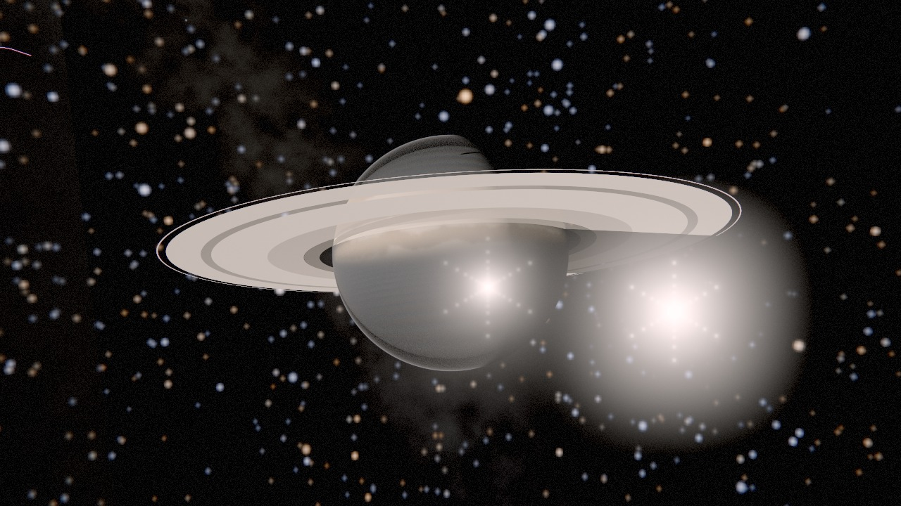
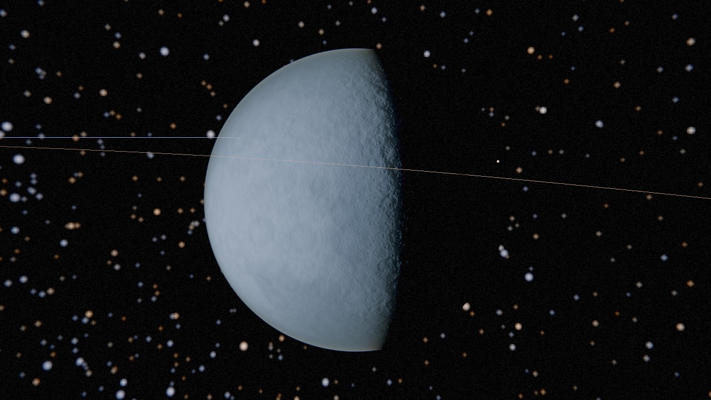
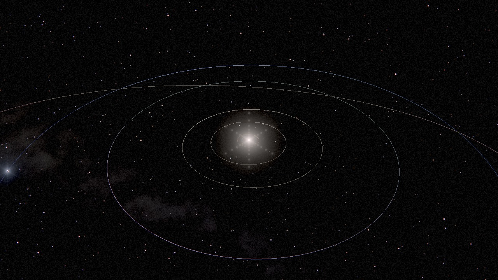

<div align="center">

# ORRERY

**A ray-traced tour of the solar system, built from NASA data — running entirely in your browser.**

[**Open the app →**](https://genovese-felipe.github.io/NASA-APIs-Opus5/)  ·  [Documentation](docs/)  ·  [Data sources](DATA-AND-CREDITS.md)  ·  [Contributing](CONTRIBUTING.md)



*Saturn on the date you load the page, at its real position, with the ring shadow across its cloud tops and the planet's shadow across the rings. Everything in this image is computed: no textures were used, no artwork was traced.*

</div>

---

## What this is

An interactive model of the solar system that is **correct first and beautiful second**, and turns out to be both.

Planet positions come from JPL's published Keplerian elements and agree with the JPL Horizons ephemeris to within 10–270 arcseconds. Radii, masses, densities, rotation periods and albedos are transcribed from JPL's physical-parameter tables. Axial tilts and rotation phases use the IAU Working Group's rotational elements, which is why Saturn's rings open and close over its 29-year year, and why the Uranian moons orbit vertically. The 8,751 stars behind everything are the real Bright Star Catalogue, coloured by their real B–V index.

It renders with a **ray tracer**, not a rasteriser — bodies are analytic quadrics, shadows are occlusion queries, and eclipses, ring shadows and mutual moon shadows all fall out of the same code path with correct umbra and penumbra.

There is no build step, no framework and no runtime dependency. The whole thing is forty-one ES modules that a browser reads directly, which means you can open the developer tools and read the source of anything you are looking at.

## Highlights

|  |  |
|---|---|
| **Ray-traced, not rasterised** | Analytic ray–spheroid intersection, so a limb is perfectly smooth at any zoom. Soft shadows come from a closed-form disc-overlap term, giving physically sized umbra and penumbra without a single stochastic sample. |
| **Physically correct light** | Solar irradiance follows the inverse-square law across the whole system: Neptune really is 900 times darker than Earth, and the exposure control opens up to compensate exactly as a spacecraft camera does. |
| **Real atmospheres** | Single-scattering Rayleigh and Mie integration through a spherical shell, using each world's true scale height — 8.5 km for Earth, 59.5 km for Saturn, 21 km for Titan. |
| **Real NASA imagery** | Earth, Mars, the Moon and Mercury are textured from GIBS and NASA Trek tile pyramids, stitched at runtime. Everything else is procedurally generated in the shader. |
| **Eleven live NASA APIs** | Picture of the Day, near-Earth objects with drawable orbits, DSCOVR's view of Earth, wildfires and volcanoes, solar flares and CMEs, and more — with an honest fallback when a service is down. |
| **8K export** | Tiled offscreen rendering with hundreds of samples per pixel, encoded to PNG without ever allocating a canvas — which is the only way to get 7680 × 4320 out of a browser at all. |
| **Video recording** | MP4 where the browser can genuinely produce it, WebM everywhere else, plus an offline path that renders a perfectly smooth orbit at any quality regardless of how fast your machine is. |
| **Ten languages** | English, 简体中文, Português (Brasil), Español, 한국어, Français, 日本語, Deutsch, Русский and العربية — the last of which drives the entire interface through a right-to-left pass. |

<div align="center">


*Earth, with an atmospheric limb integrated from real Rayleigh and Mie coefficients, and the Pleiades over its shoulder. This frame was rendered in CI with all network access blocked, so the surface is the procedural fallback — in a browser it is NASA's Blue Marble, streamed from GIBS.*

</div>

## Try it

```bash
git clone https://github.com/Genovese-Felipe/NASA-APIs-Opus5.git
cd NASA-APIs-Opus5
npm run dev          # http://localhost:8080
```

No install step is needed to *run* it — `npm install` is only for the test suite.
Any static server will do; `tools/serve.mjs` is thirty lines and has no dependencies.

There is also a **single-file build**: `npm run build:artifact` produces `standalone.html`, one self-contained file with the whole application and all 8,751 stars inside it. Open it with `file://`, email it, put it on a USB stick; it needs nothing.

> **Opening `index.html` straight from the file system will not work.** The app is
> native ES modules, and browsers refuse to load modules over `file://`. That is
> what `standalone.html` is for — it is a single file with no imports, so it opens
> from disk with no server at all.

### The published site is 404

GitHub Pages has to be enabled by a repository admin before anything can deploy
to it, and a workflow token is not allowed to enable it — the deploy fails with
`Resource not accessible by integration`, or just `Not Found`, while every other
check stays green. One-time fix:

**Settings → Pages → Build and deployment → Source: “GitHub Actions”**

Then push to `main`, or run *Deploy to GitHub Pages* from the Actions tab against
whichever branch you want to publish.

In the meantime every CI run uploads the whole built site — `standalone.html`
included — as a downloadable artifact. Actions → the run → **Artifacts → site**.

## What you can do

**Move around.** Drag to orbit, scroll to zoom, click any world to go there. Press <kbd>F</kbd> for six-degree-of-freedom flight, where your speed scales with how far the nearest thing is, so the same key feels right skimming Enceladus and crossing the Kuiper Belt.

**Move time.** Scrub from 3000 BC to AD 3000 and watch Saturn's rings open and close, Jupiter's moons weave through their Laplace resonance, and the inner planets lap the outer ones. Press <kbd>N</kbd> to snap back to this instant.

**Take the tours.** Five guided sequences, each making a point that is easier to see than to explain: what casts the shadow on Saturn's clouds, why a total eclipse requires a coincidence, and why every diagram of the solar system you have ever seen is a lie about scale.

**Look at the data.** Sixteen NASA services feed the panels, and a Data Health view tells you exactly where every number came from — live, cached, or a snapshot our CI committed last night — and how old it is.

**Take it away.** Export a still at up to 8K with hundreds of samples per pixel, or record video. Every export embeds the simulated date in its metadata, so a picture is reproducible.

<div align="center">


*The inner system from about 40 astronomical units. The planets are points of light at the correct apparent magnitude — which is exactly how much of the solar system there is to see.*

</div>

## How it works

```
index.html ─── src/main.js ─┬─ ui/          interface, i18n, tours, labels
                            ├─ render/      WebGL2 ray tracer, export, capture
                            ├─ astro/       ephemeris, Kepler, catalogues
                            ├─ data/        NASA API clients and snapshots
                            └─ audio/       synthesised soundscape
```

The renderer runs six passes: a fragment shader that ray-traces the scene into a floating-point buffer, the star catalogue as point sprites blended against the coverage that shader wrote, a vector overlay for orbit paths, temporal accumulation that keeps refining the image while you hold still, a bloom pyramid, and a composite that tone-maps and grades.

Everything inside the shader is **camera-relative and measured in megametres**. That one decision is what lets a scene 4.5 billion kilometres across render in 32-bit floats without cracks.

Full detail is in [`docs/architecture.md`](docs/architecture.md); the physics and the accuracy limits are in [`docs/science.md`](docs/science.md).

## The data

Sixteen NASA and JPL services are integrated — eleven called live from the browser, five fetched ahead of time because they refuse cross-origin requests — and two more are documented as retired with the evidence. That is not incidental detail — a third of the endpoints listed on `api.nasa.gov` either block browsers or have quietly stopped working, and pretending otherwise produces an app that is broken for half its visitors.

| | |
|---|---|
| **Live from the browser** | APOD · Asteroids NeoWs · EPIC · EONET · DONKI · Image and Video Library · GIBS · Trek WMTS · POWER · Satellite Situation Center · TLE |
| **Fetched nightly by CI** | JPL SSD/CNEOS (close approaches, impact risk, fireballs) · NASA Exoplanet Archive · TechPort · OSDR/GeneLab · TechTransfer — all five block cross-origin browser access |
| **Retired, and why** | Mars Rover Photos (backend gone) · Earth/Landsat imagery (connections hang) |

Two operational details worth knowing:

- **`DEMO_KEY` allows 30 requests an hour**, shared by everyone on your network address. The app caches aggressively, de-duplicates in flight, reads the remaining quota from the response headers, and falls back to committed snapshots — so it stays usable when the quota is gone. Adding [your own free key](https://api.nasa.gov/#signUp) raises the limit to 1,000 an hour; it is stored only in your browser and sent only to `api.nasa.gov`.
- **DONKI is fetched from the CCMC origin**, not from `api.nasa.gov`, because the mirror has been returning 502 and 503 for an extended period while the origin behind it is healthy, needs no key, and sends the right CORS header.

Every source, its terms, and the required attribution are in [`DATA-AND-CREDITS.md`](DATA-AND-CREDITS.md).

## Accuracy, honestly

| Quantity | Method | Accuracy |
|---|---|---|
| Planet positions | JPL approximate elements (Standish & Williams 1992) | 8″ (Venus) to 270″ (Saturn) against Horizons |
| Earth's position | Same, corrected for the Earth–Moon barycentre offset | ~10″ |
| Satellite positions | JPL mean elements, precessing-ellipse fit | Degrades over decades; marked approximate in the UI |
| Physical parameters | JPL fact tables, transcribed | As published |
| Axial orientation | IAU WGCCRE 2015 rotational elements | As published |
| Star positions | Bright Star Catalogue, J2000, no proper motion | Sub-arcsecond at epoch |
| Pluto | Classical 1992 elements; absent from the modern table | Markedly looser |

Good enough to be right about where everything is. Not good enough to navigate a spacecraft, and the app says so.

Two deliberate departures from physics, both documented in the interface and switchable:

1. **Star brightness is held constant** rather than scaling with exposure, so the sky is visible at Mercury and not blinding at Neptune. Turn on *Physical star brightness* for the uncompromising version.
2. **Distant planets are drawn as "beacons"** at their true apparent magnitude, matched to the star scale, so a wide view of the system is not empty. The physically continuous term is always there underneath.

## Quality and testing

```bash
npm run check      # lint, locales, scientific data, unit tests
npm test           # 195 unit tests
npm run test:e2e   # 38 browser tests with real WebGL2
```

- **195 unit tests** covering the Kepler solver against its own residual, orbital energy and angular momentum conservation, planet positions against JPL Horizons reference vectors, the PNG encoder against the reference CRC-32, the camera basis for orthonormality, and every locale for plural correctness.
- **38 end-to-end tests** in a real browser with real WebGL2 (ANGLE over SwiftShader, so no GPU needed): the shaders compile, the frame contains a lit planet, a 1080p export is a structurally valid PNG of exactly the right size, tiled rendering leaves no seam, all ten languages render with no untranslated keys, and every interactive control has an accessible name. **All external network access is blocked during the run** — the app is built to work from committed data, so an offline test is both valid and repeatable.
- **A scientific data validator** that cross-checks every number against physics rather than against itself: density from mass and radius, orbital periods from Kepler's third law, every satellite inside its planet's Hill sphere and outside the Roche limit. It has already caught two real modelling errors — one of which correctly identified that Phobos orbits *inside* Mars's fluid Roche limit.
- **A focused linter** for the mistakes that break a deployed static site: root-absolute paths, unresolvable imports, `innerHTML`, and any fetch host missing from the Content Security Policy.

## Accessibility

The interface is HTML over the canvas, never text drawn into WebGL — which is what makes Arabic shape correctly, Japanese pick the right font, and a screen reader able to read anything at all. Beyond that: a skip link, a labelled and described canvas, an ARIA live region that announces every change of focus, full keyboard operation, a reduced-motion mode that removes camera easing and auto-orbit, a high-contrast theme, a larger-text mode, and a photosensitivity note next to the bloom controls.

## Licence

Code is [MIT](LICENSE). NASA data and imagery are governed by NASA's media usage guidelines; see [`DATA-AND-CREDITS.md`](DATA-AND-CREDITS.md).

**This project is not endorsed by, affiliated with, or sponsored by NASA or JPL.** The NASA insignia, logotype and seal are protected marks and are not used here.

---

<div align="center">
<sub>Built with public data from NASA, JPL, and the people who spent their careers gathering it.</sub>
</div>
