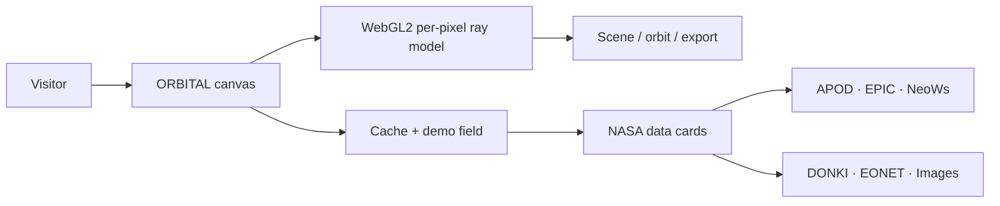

# ORBITAL / NASA API Observatory

ORBITAL is a static, GitHub Pages-ready observatory for exploring NASA’s public data as a visual instrument. It joins astronomy imagery, Earth observation, near-Earth objects, natural events, and space-weather records in one resilient field that still works when a live endpoint is slow or unavailable.

The project is intentionally dependency-light: the experience is one `index.html`, with no framework, bundler, remote UI library, proprietary artwork, tracking script, or committed credential. It can be opened as a standalone HTML artifact or served from GitHub Pages.

## Experience map



The visual output is not a downloaded “space background.” In WebGL2, every rendered pixel forms a camera ray, intersects a procedural sphere, shades the surface, and layers a star field, atmospheric rim, orbital geometry, and scene-specific signal. Canvas 2D is used as an explicit fallback for devices that cannot create WebGL2.

## Included now

| Area | Delivery |
| --- | --- |
| NASA data | APOD, EPIC, NeoWs, DONKI FLR, DONKI CME, EONET v3, NASA Image Library, Earth Imagery |
| Visual modes | Deep Field, Earth / EPIC, Solar Pulse, Archive Moon |
| Navigation | Pointer drag, touch pointer events, wheel zoom, WASD, arrows, `+`/`-`, reset |
| Orbit mode | Adjustable orbit speed and time scale, keyboard toggle, reduced-motion respect |
| Rendering | WebGL2 procedural ray tracing, Canvas 2D fallback, Low / Medium / High / Ultra |
| Capture | PNG, JPEG, WebP; viewport, 4K, and 8K targets constrained by the browser/GPU |
| Video | `MediaRecorder`; chooses MP4 only when advertised, otherwise WebM |
| Audio | Generative Web Audio sonification, activated by user gesture; no bundled music |
| Reliability | Timeout, `Promise.all`, cache-first state, explicit LIVE / DEMO / FALLBACK badges |
| Education | In-app exploration guide, source rail, provenance notes, keyboard flight deck |
| Localization | English, Portuguese, Chinese, Spanish, Korean, French, Japanese, German, Arabic, Hindi |

## NASA API surface

The connected set is described in [docs/API-MAP.md](docs/API-MAP.md). The interface never hides a failure behind an empty card: each source gets a status and the app can continue with a small, deterministic demonstration dataset.

The NASA API portal currently notes that the Mars Rover API has been archived, so it is intentionally not presented as a working live source. NASA API availability and response shapes can change; the source rail and fallback design are part of the product, not an afterthought.

## Run locally

The app is static, but a local HTTP server is recommended because browser security rules are stricter for `file://` pages:

```bash
python3 -m http.server 8080
```

Open <http://localhost:8080/>. For a scene deep-link, use `?scene=earth`, `?scene=solar`, or `?scene=archive`.

The `DEMO_KEY` is used by default. To use a personal NASA key, open Settings inside the app. It is stored only in the current browser’s local storage and is redacted from JSON exports. Never place a personal key in this repository.

## GitHub Pages

The workflow at `.github/workflows/pages.yml` publishes the repository root on pushes to `main` and on manual dispatch. In the repository settings, set Pages → Build and deployment → Source to **GitHub Actions**. No build step is required.

## Captures and video

The Capture control uses the selected format and size from Settings. 4K and 8K are targets, not guarantees: the browser may cap canvas dimensions or run out of memory, so ORBITAL scales conservatively and reports the actual pixels in the toast. `MediaRecorder` commonly exposes WebM in Chromium and Firefox; MP4 is used only where `MediaRecorder.isTypeSupported()` reports it.

Video records the observatory canvas. Audio sonification is intentionally not injected into the recording stream because browser audio routing differs across platforms; this keeps the file reliable and avoids pretending that an audio track exists when it does not.

## Controls

| Input | Action |
| --- | --- |
| Drag / touch | Rotate the viewpoint |
| Wheel / `+` / `-` | Zoom |
| `W A S D` or arrows | Nudge the camera |
| Space | Toggle orbit mode |
| `R` | Reset viewpoint |
| `M` | Toggle ambient sonification |
| `1`–`4` | Select a scene |

## Verification

Run the project smoke test with:

```bash
npm test
```

The checks validate the inline JavaScript syntax, required UI anchors, connected API catalog, fallback markers, and GitHub Pages workflow. Detailed manual and data-quality checks are in [docs/VALIDATION.md](docs/VALIDATION.md).

## Governance principles

1. **No credential commits.** API keys are runtime configuration only.
2. **No silent fallback.** Demonstration values are labeled in the UI and status export.
3. **No fake codec promises.** The recorder chooses a browser-supported MIME type.
4. **No false scientific precision.** The renderer is educational and visual; NASA payloads remain the source of record.
5. **Graceful degradation.** A missing WebGL2 context, an API timeout, an image error, or storage denial must leave exploration usable.
6. **Source-first documentation.** Every live integration links to its official source or documentation.

## Official references

- [NASA Open APIs portal](https://api.nasa.gov/)
- [NASA API documentation repository](https://github.com/nasa/api-docs)
- [EONET v3 documentation](https://eonet.gsfc.nasa.gov/docs/v3)
- [NASA Image and Video Library](https://images.nasa.gov/)
- [NASA Earthdata EONET overview](https://www.earthdata.nasa.gov/data/tools/eonet)

## License and attribution

The application code is provided by this repository’s owner for experimentation and education. NASA data is accessed from the public services linked above; individual media records may carry their own credit and usage terms. ORBITAL is not affiliated with or endorsed by NASA.
