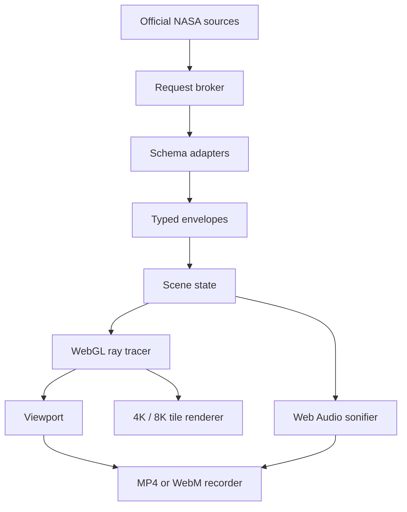

# Architecture

## Design principle

The canvas is an instrument, not a background image. The visual result is computed from camera, scene, time, quality, and normalized data-state inputs. Source media is presented in a separate, attributed archive surface.

## Runtime layers

### 1. Request broker

`RequestBroker` provides:

- a maximum of three concurrent browser requests;
- a 14-second abort timeout;
- per-source TTL caches;
- stale-cache recovery after a network failure;
- no retries that could amplify a rate-limit event;
- no logging of request URLs, which could contain a user-supplied NASA key.

### 2. Schema boundary

Every API response is treated as untrusted input. Normalizers accept `unknown`, validate the minimum required shape, coerce documented numeric strings, cap arrays, and emit narrow internal types. The interface never injects source text as HTML.

### 3. Provenance envelope

Each result carries:

- `mode`: `live`, `cache`, or `demo`;
- source name;
- local acquisition time;
- source timestamp when available.

The UI uses that envelope directly. A fallback cannot silently inherit a live badge.

### 4. Computational renderer

The renderer draws one full-screen triangle. The fragment shader reconstructs an absolute camera ray for every output pixel. This makes the same renderer reusable for the viewport and tiled 8K exports.

Implemented visual models:

- analytic ray–sphere intersection;
- procedural surface fields and cloud layers;
- Lambertian illumination, atmospheric rim, limb response, and night-side energy;
- planar orbital curves;
- per-event Earth surface beacons from EONET longitude/latitude;
- deterministic asteroid positions with live population/risk modulation;
- procedural solar surface, corona, and event-energy plume;
- compact gravitational deflection approximation and accretion-disc intersection;
- procedural star field and galactic band;
- ACES-inspired tone mapping and light grain.

The model is educational. It does not claim ephemeris-grade dynamics or full relativistic geodesic integration.

### 5. Quality controller

Auto quality selects a starting profile from coarse device capability and then adjusts internal render scale using measured frame rate. Manual profiles never auto-change. Rendering runs on `requestAnimationFrame` without a 60 Hz timer cap.

### 6. Export pipeline

For 4K and 8K, the shader receives `u_fullResolution` and `u_tileOrigin`. Every tile calculates global pixel coordinates, so neighboring tiles share the same projection and do not create seam discontinuities. WebGL pixels are row-flipped into a 2D assembly canvas, encoded with `toBlob`, and released after download.

### 7. Recording pipeline

The visible WebGL canvas provides a video track. When sonification is active, a cloned Web Audio destination track is added. `MediaRecorder` selects the first supported MIME type in this order:

1. H.264 MP4;
2. generic MP4;
3. VP9 WebM;
4. VP8 WebM;
5. generic WebM.

## Static hosting

Vite emits relative paths (`base: './'`) so the same build works at the GitHub project subpath, on another static host, and inside the self-contained artifact. The GitHub Pages workflow runs tests and the distribution validator before deployment.
