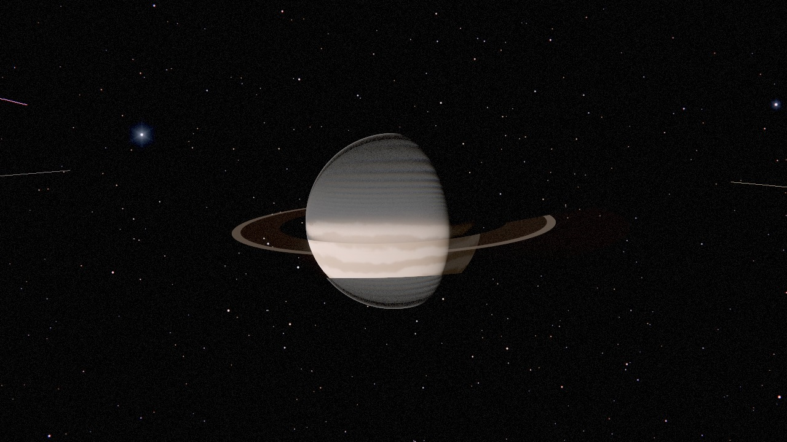
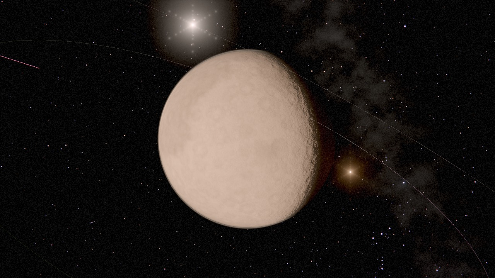
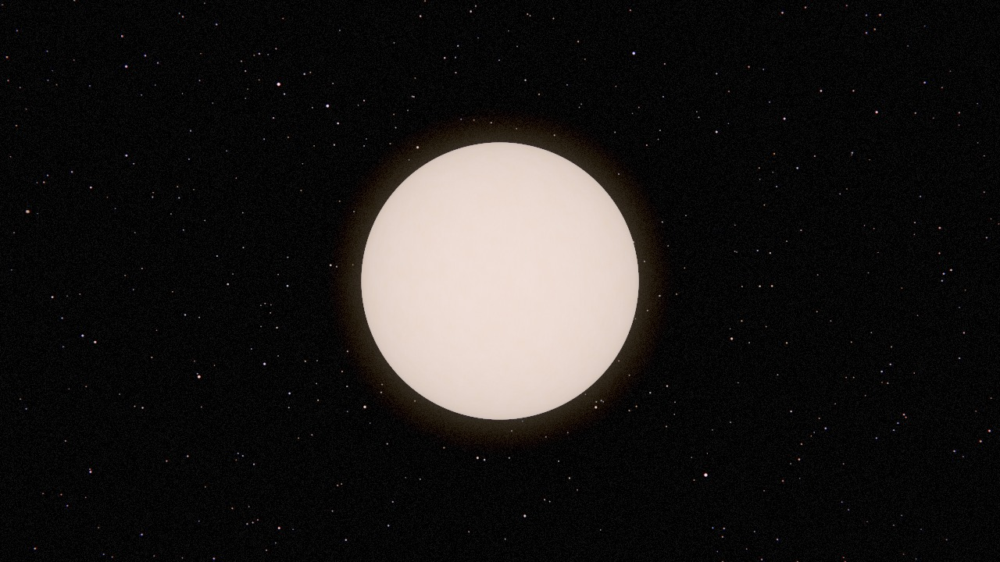

# ORRERY documentation

**[Open the app →](https://genovese-felipe.github.io/NASA-APIs-Opus5/)**

The application itself is fully translated into ten languages. This
documentation is in English, with a summary and orientation in each of the other
nine below.

## The guides

| | |
|---|---|
| **[Using ORRERY](user-guide.md)** | Every control, what it does, and the reasoning behind the parts that are not obvious. Start here. |
| **[Architecture](architecture.md)** | How it is built and why — the ray tracer, the precision problem, the pass chain, the data layer. |
| **[The science](science.md)** | What is computed from what, how accurate it is, and where the model departs from physics. |
| **[The NASA APIs](apis.md)** | A field guide to eighteen services: which work from a browser, which do not, and which have quietly been retired. |
| **[Data and credits](../DATA-AND-CREDITS.md)** | Where every number and image comes from, and the terms. |
| **[Contributing](../CONTRIBUTING.md)** | How to make a change that will be merged. |

## The pictures in this documentation

Every image is rendered by the application itself, by
`tools/capture-screenshots.mjs`, at a stated date and camera position. They are
not mock-ups. `docs/images/manifest.json` records the exact parameters of each.

They are also rendered **with all network access blocked**, which is worth
saying because it changes what you are looking at. Earth, Mars, the Moon and
Mercury are normally textured from GIBS and NASA Trek tile pyramids; with
nothing to fetch, the shader falls back to procedural surfaces. So these are
honest pictures of the geometry, the lighting and the atmospheres, and honest
pictures of what the application looks like offline — but the real Blue Marble
and the real Viking mosaic only appear when you open it in a browser.

| | |
|---|---|
|  |  |
| **Saturn.** The ring shadow on the cloud tops and the planet's shadow on the rings are the same occlusion term, evaluated in both directions. The Cassini Division is a low-opacity row in the ring table, not a texture. | **Jupiter.** The bands are warped in longitude only, which is what makes them shear rather than smear — the cheapest convincing model of a zonal wind. The oblateness is not stylised: the equatorial radius really is 6.5 per cent larger than the polar one. The ring is barely there, which is correct — see the note on ring opacity in [the science page](science.md#rings). |
|  |  |
| **Mars.** The thin atmosphere uses Mars's own Rayleigh coefficients, which is why the limb is dusty rather than blue. In a browser the surface is the Viking MDIM 2.1 colour mosaic from NASA Trek, stitched from WMTS tiles at load time; here it is the procedural fallback. | **The Sun.** Limb darkening is the quadratic law, 1 − 0.47(1−μ) − 0.23(1−μ)²; the corona is a separate radial term outside the disc. The exposure is metered on how much of the frame the disc fills, so it closes by a factor of sixty as you approach — exactly as a camera's would. |

---

## In your language

The application interface is fully translated. Open it with `?lang=` to start in
a given language — for example
[`?lang=ja`](https://genovese-felipe.github.io/NASA-APIs-Opus5/?lang=ja) — or
use the 文A button in the header.

### 简体中文

**ORRERY** 是一个在浏览器中运行的太阳系交互模型，全部基于 NASA 与 JPL 的公开数据。

行星位置来自 JPL 发布的开普勒轨道根数，与 JPL Horizons 星历的偏差在 10 至 270 角秒之间。半径、质量、密度、自转周期与反照率均转录自 JPL 的物理参数表。自转轴取向采用 IAU 的自转要素——这正是土星光环会随其 29 年公转周期张开又闭合、天王星的卫星近乎垂直环绕的原因。背景中的 8,751 颗恒星来自真实的《亮星星表》，颜色由各自的 B–V 色指数计算得出。

渲染使用**光线追踪**而非光栅化：天体是解析二次曲面，阴影是遮挡查询，日月食、光环投影与卫星互掩都由同一段代码得出，本影与半影的尺度物理正确。

支持最高 8K 静态图导出与视频录制，界面提供十种语言。

[打开应用](https://genovese-felipe.github.io/NASA-APIs-Opus5/?lang=zh-Hans)

### Português (Brasil)

**ORRERY** é um modelo interativo do Sistema Solar que roda inteiramente no seu
navegador, montado a partir de dados públicos da NASA e do JPL.

As posições dos planetas vêm dos elementos keplerianos publicados pelo JPL e
concordam com a efeméride JPL Horizons dentro de 10 a 270 segundos de arco.
Raios, massas, densidades, períodos de rotação e albedos são transcritos das
tabelas de parâmetros físicos do JPL. As inclinações axiais usam os elementos de
rotação da IAU — é por isso que os anéis de Saturno abrem e fecham ao longo do
seu ano de 29 anos, e por que as luas de Urano orbitam na vertical. As 8.751
estrelas ao fundo são o Bright Star Catalogue real, coloridas pelo seu índice
B–V verdadeiro.

A renderização usa **traçado de raios**, não rasterização: os corpos são
quádricas analíticas, as sombras são consultas de oclusão, e eclipses, sombras
de anéis e sombras mútuas entre luas surgem todos do mesmo caminho de código,
com umbra e penumbra fisicamente corretas.

Exportação de imagens em até 8K, gravação de vídeo, e interface em dez idiomas.

[Abrir o aplicativo](https://genovese-felipe.github.io/NASA-APIs-Opus5/?lang=pt-BR)

### Español

**ORRERY** es un modelo interactivo del Sistema Solar que funciona por completo
en tu navegador, construido con datos públicos de la NASA y el JPL.

Las posiciones planetarias proceden de los elementos keplerianos publicados por
el JPL y coinciden con la efeméride JPL Horizons dentro de 10 a 270 segundos de
arco. Radios, masas, densidades, periodos de rotación y albedos están
transcritos de las tablas de parámetros físicos del JPL. Las inclinaciones
axiales usan los elementos de rotación de la IAU: por eso los anillos de Saturno
se abren y se cierran a lo largo de su año de 29 años, y por eso las lunas de
Urano orbitan en vertical. Las 8.751 estrellas del fondo son el Bright Star
Catalogue real, coloreadas según su índice B–V verdadero.

El renderizado usa **trazado de rayos**, no rasterización: los cuerpos son
cuádricas analíticas, las sombras son consultas de oclusión, y los eclipses, las
sombras de los anillos y las sombras mutuas entre lunas surgen todos del mismo
código, con umbra y penumbra físicamente correctas.

Exportación de imágenes hasta 8K, grabación de vídeo e interfaz en diez idiomas.

[Abrir la aplicación](https://genovese-felipe.github.io/NASA-APIs-Opus5/?lang=es)

### 한국어

**ORRERY**는 NASA와 JPL의 공개 데이터로 구성된, 브라우저에서 완전히 동작하는
태양계 대화형 모형입니다.

행성 위치는 JPL이 공개한 케플러 궤도 요소에서 계산하며, JPL Horizons 천체력과
10~270초각 이내로 일치합니다. 반지름·질량·밀도·자전 주기·알베도는 JPL 물리
매개변수 표에서 그대로 옮겨 왔습니다. 자전축 방향에는 IAU 자전 요소를 사용합니다.
토성 고리가 29년 주기로 열렸다 닫히고, 천왕성의 위성들이 거의 수직으로 도는
이유가 바로 여기에 있습니다. 배경의 8,751개 별은 실제 Bright Star Catalogue이며,
각각의 B–V 색지수로 색을 계산했습니다.

렌더링은 래스터화가 아니라 **광선 추적**을 사용합니다. 천체는 해석적 이차곡면이고
그림자는 차폐 질의이므로, 일식·월식, 고리 그림자, 위성 간 상호 그림자가 모두 같은
코드에서 나오며 본영과 반영의 크기가 물리적으로 정확합니다.

최대 8K 정지 영상 내보내기, 동영상 녹화, 10개 언어 인터페이스를 지원합니다.

[앱 열기](https://genovese-felipe.github.io/NASA-APIs-Opus5/?lang=ko)

### Français

**ORRERY** est un modèle interactif du Système solaire qui fonctionne entièrement
dans votre navigateur, construit à partir de données publiques de la NASA et du
JPL.

Les positions des planètes proviennent des éléments képlériens publiés par le
JPL et concordent avec l'éphéméride JPL Horizons à 10 à 270 secondes d'arc près.
Rayons, masses, densités, périodes de rotation et albédos sont transcrits des
tables de paramètres physiques du JPL. Les inclinaisons axiales utilisent les
éléments de rotation de l'UAI — c'est pourquoi les anneaux de Saturne s'ouvrent
et se referment au fil de son année de 29 ans, et pourquoi les lunes d'Uranus
orbitent à la verticale. Les 8 751 étoiles en arrière-plan sont le véritable
Bright Star Catalogue, colorées selon leur indice B–V réel.

Le rendu utilise le **lancer de rayons**, pas la rastérisation : les corps sont
des quadriques analytiques, les ombres sont des requêtes d'occlusion, et les
éclipses, les ombres des anneaux et les ombres mutuelles entre lunes découlent
toutes du même code, avec une ombre et une pénombre physiquement correctes.

Export d'images jusqu'en 8K, enregistrement vidéo et interface en dix langues.

[Ouvrir l'application](https://genovese-felipe.github.io/NASA-APIs-Opus5/?lang=fr)

### 日本語

**ORRERY** は、NASA と JPL の公開データだけで構築された、ブラウザ上で完結する
太陽系のインタラクティブモデルです。

惑星の位置は JPL が公開しているケプラー軌道要素から計算しており、JPL Horizons
の暦とは 10〜270 秒角の範囲で一致します。半径・質量・密度・自転周期・アルベドは
JPL の物理パラメータ表から転記しました。自転軸の向きには IAU の自転要素を用いて
います。土星の環が 29 年周期で開閉するのも、天王星の衛星がほぼ垂直に公転するのも
そのためです。背景の 8,751 個の恒星は実際の Bright Star Catalogue で、色はそれ
ぞれの B–V 色指数から計算しています。

描画にはラスタライズではなく**レイトレーシング**を用います。天体は解析的な二次曲面、
影は遮蔽判定なので、日食・月食、環の影、衛星どうしの相互影がすべて同じコードから
生まれ、本影と半影の大きさも物理的に正しくなります。

最大 8K の静止画書き出し、動画録画、10 言語のインターフェースに対応しています。

[アプリを開く](https://genovese-felipe.github.io/NASA-APIs-Opus5/?lang=ja)

### Deutsch

**ORRERY** ist ein interaktives Modell des Sonnensystems, das vollständig im
Browser läuft und aus öffentlichen Daten der NASA und des JPL aufgebaut ist.

Die Planetenpositionen stammen aus den vom JPL veröffentlichten Kepler-Elementen
und stimmen mit der JPL-Horizons-Ephemeride auf 10 bis 270 Bogensekunden überein.
Radien, Massen, Dichten, Rotationsperioden und Albedos sind aus den
JPL-Tabellen physikalischer Parameter übernommen. Die Achsneigungen verwenden die
Rotationselemente der IAU — deshalb öffnen und schließen sich die Saturnringe im
Lauf seines 29-jährigen Jahres, und deshalb umkreisen die Uranusmonde ihren
Planeten senkrecht. Die 8.751 Sterne im Hintergrund sind der echte Bright Star
Catalogue, eingefärbt nach ihrem tatsächlichen B–V-Index.

Gerendert wird mit **Raytracing**, nicht mit Rasterisierung: Körper sind
analytische Quadriken, Schatten sind Verdeckungsabfragen, und Finsternisse,
Ringschatten und gegenseitige Mondschatten ergeben sich alle aus demselben Code
— mit physikalisch korrektem Kern- und Halbschatten.

Bildexport bis 8K, Videoaufnahme und eine Oberfläche in zehn Sprachen.

[Anwendung öffnen](https://genovese-felipe.github.io/NASA-APIs-Opus5/?lang=de)

### Русский

**ORRERY** — интерактивная модель Солнечной системы, работающая целиком в
браузере и построенная на открытых данных NASA и JPL.

Положения планет вычисляются по кеплеровым элементам, опубликованным JPL, и
совпадают с эфемеридой JPL Horizons с точностью от 10 до 270 угловых секунд.
Радиусы, массы, плотности, периоды вращения и альбедо перенесены из таблиц
физических параметров JPL. Наклон осей задан вращательными элементами МАС —
именно поэтому кольца Сатурна раскрываются и закрываются за его 29-летний год, а
спутники Урана обращаются почти вертикально. 8 751 звезда на фоне — это реальный
Bright Star Catalogue, а их цвета вычислены по настоящему показателю B–V.

Рендеринг выполняется **трассировкой лучей**, а не растеризацией: тела — это
аналитические квадрики, тени — запросы перекрытия, поэтому затмения, тени колец
и взаимные тени спутников получаются из одного и того же кода, с физически
верными размерами тени и полутени.

Экспорт изображений до 8K, запись видео и интерфейс на десяти языках.

[Открыть приложение](https://genovese-felipe.github.io/NASA-APIs-Opus5/?lang=ru)

### العربية

**ORRERY** نموذج تفاعلي للمجموعة الشمسية يعمل بالكامل داخل المتصفّح، مبنيّ من
بيانات مفتوحة تنشرها ناسا ومختبر الدفع النفّاث.

مواضع الكواكب محسوبة من العناصر الكبلرية التي ينشرها المختبر، وتتوافق مع تقويم
JPL Horizons ضمن هامش يتراوح بين 10 و270 ثانية قوسية. أنصاف الأقطار والكتل
والكثافات وفترات الدوران ومعاملات الانعكاس منقولة حرفيًا عن جداول المعاملات
الفيزيائية للمختبر. أمّا ميل المحاور فيعتمد على عناصر الدوران التي أقرّها الاتحاد
الفلكي الدولي — ولهذا السبب تنفتح حلقات زحل وتنغلق على مدى سنته البالغة 29 عامًا،
ولهذا السبب تدور أقمار أورانوس عموديًا. والنجوم الـ8751 في الخلفية هي فهرس
النجوم الساطعة الحقيقي، ملوّنة بحسب دليل اللون B–V الفعلي لكل نجم.

يعتمد العرض على **تتبّع الأشعّة** لا على الترقيم النقطي: الأجرام أسطح تربيعية
تُحسب تحليليًا، والظلال استعلامات حجب، ولذلك تنشأ الكسوفات والخسوفات وظلال
الحلقات والظلال المتبادلة بين الأقمار كلها من المسار البرمجي نفسه، بظلّ تام وشبه
ظلّ بأبعاد صحيحة فيزيائيًا.

تصدير الصور حتى دقة 8K، وتسجيل الفيديو، وواجهة بعشر لغات.

[افتح التطبيق](https://genovese-felipe.github.io/NASA-APIs-Opus5/?lang=ar)

---

## Would you like to help translate the documentation?

The interface is fully translated; these guides are not. If you would like to
translate one, open an issue and say which — it is genuinely useful work, and
[CONTRIBUTING.md](../CONTRIBUTING.md) explains the conventions.
